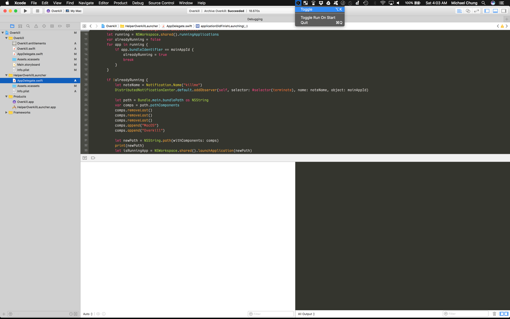

OverKill: An app that stop’s iTunes and iPhotos from being annoying when you are working with xCode.

http://www.mediafire.com/file/r5weqgavmckjqff/Overkill.app.zip

I created this app for other OSX/iOS Developers who are tired of having iPhoto and iTunes open on them while in the middle of development because of reattaching the USB cable. 

Please note: This app will force quit iPhotos and iTunes ONLY when you have xCode open. 

So, the backstory.

I found that as my journey throughout boot camp progressed, the only real complaint I had was how whenever I plugged my iPhone into my Mac, iTunes and iPhotos would open. This quickly became super annoying, especially in those instances where I accidentally unplugged my iPhone. So, I created this app. As I was showing my friend, what I thought of as, my big accomplishment, he kindly informed that there was already a Ruby script for this. Well, that sucked. After much deliberation, I decided to still release the app, as I had put so much time and effort into creating this, as well as it being something nifty I can have in my portfolio. I decided that I did not want to steal any credit or fame from Felix Krause, the creator of the OverKill Ruby script. So instead, I decided to keep the name the same, as a homage to Felix and his work.

As I’ve mentioned before, I am still learning. So, there are a couple of features that I would like to add in the future, once I learn them. I would like to be able to program the ability for the app to open upon turning the computer on. I also want to be able to integrate the touchbar feature into the user interface. Though, I still need to look into whether there is global touchbar support, or just content specific support. 

If you liked this app, or found it to be useful for your needs, please share with your friends. Also, as this is my first app, I would greatly appreciate any feedback or suggestions on how to improve this app.

Yap. That’s about that! Thanks for looking~!  

Fund me on gofundme here:
https://www.gofundme.com/replacement-macbook-for-career-goal

http://www.mediafire.com/file/r5weqgavmckjqff/Overkill.app.zip
# License
MIT

# Images

